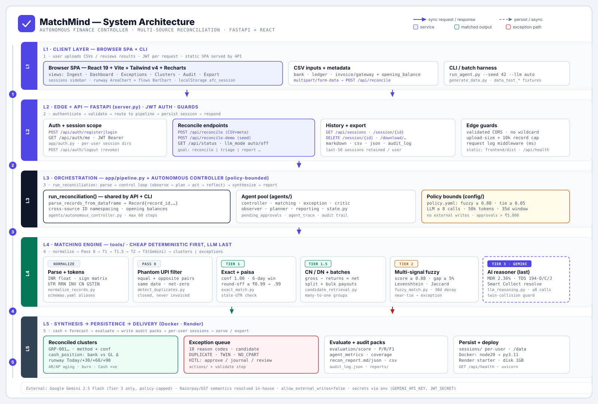

# 🧠 MatchMind: Autonomous AI Finance Controller & Multi-Source Reconciliation Agent

> **Built for Razorpay Buildathon Hackathon**  
> An autonomous financial reconciliation engine that ingests **Bank Feeds**, **General Ledgers**, and **Invoices/Credit Notes**, performs 3-way multi-tier reconciliation, resolves Indian payment gateway fees (Razorpay MDR & TDS), guards against duplicate collisions, and models 30/60/90-day forward cash runway.

[](https://github.com/getdownandcode/ai-finance-controller)
[](https://github.com/getdownandcode/ai-finance-controller)
[](https://github.com/getdownandcode/ai-finance-controller)
[%20%2F%20Razorpay-orange)](https://github.com/getdownandcode/ai-finance-controller)

---

## 📖 Comprehensive Documentation
For a deep dive into system architecture, multi-tier decisioning, Indian fintech logic, cash runway modeling, and full data flow, read **[`PROJECT_DOCUMENTATION.md`](PROJECT_DOCUMENTATION.md)**.

## 🏛️ System Architecture



**How it works (5-second version):** financial records flow in from the left → the Web Dashboard + REST API accept and scope them → the **Reconciliation Orchestrator** runs a 7-step workflow (ingest → normalize → compare → candidates → evaluate → exceptions → synthesize) → the **Matching Engine** tries deterministic tiers first (**Exact → Batch → Fuzzy**) and sends only ambiguous cases to **Google Gemini** → **Policy & Validation** gates every decision → results fan out to **Reconciled Results**, **Exception Queue**, and **Reports & Audit**, all retained in **Session & History Storage**.

- **Deterministic first, AI last** — AI never owns the pipeline; it only sees cases rules can't decide, bounded by confidence thresholds, approval rules and safety checks.
- **Clear boundaries** — users, data sources and Gemini sit outside the MatchMind application boundary; everything inside is the system we built and demo.

---

## ⚡ Core Superpowers

1. **🇮🇳 Indian Fintech & Razorpay Native**:
   - Denominated in Indian Rupees (`INR` / `₹`) with Lakhs/Crores formatting.
   - **Razorpay Standard MDR Solver**: Accurately matches gross invoices with net bank settlements after deducting 2.0% MDR + 18% GST (2.36% total fee).
   - **TDS Compliance**: Resolves Section 194-O (1%), Section 194C (2%), and Section 194J (10%) deductions.
   - **Razorpay Payouts**: Detects IMPS (₹5.90) and NEFT/RTGS (₹11.80) payout fees.

2. **🛡️ 5-Tier Decisioning Engine**:
   - **Pass 0**: Phantom Net-Zero UPI & Auto-Reversal Filter (prevents fake matches on failed transactions).
   - **Tier 1**: Deterministic Exact & Precision Paisa Round-off Rule ($\le ₹0.99$ GST rounding).
   - **Tier 1.5**: Credit Notes & Debit Notes (aggregates sales returns into net bank payouts).
   - **Tier 2**: Multi-Signal Fuzzy Matcher with 30-day adaptive terms window.
   - **Tier 3**: Autonomous AI Reasoner (Gemini 2.5 Flash) with Indistinguishable Twin Collision Guard.

3. **📈 30/60/90-Day Forward Cash Runway Forecaster**:
   - 4-Step Forward Liquidity Trajectory (`Today`, `+30d`, `+60d`, `+90d`).
   - Accounts Receivable (AR) vs Accounts Payable (AP) Aging Buckets (`0-30d`, `31-60d`, `61-90d+`).
   - Dynamic runway calculation and monthly net burn rate monitoring.

4. **💻 Full-Stack Interactive UI**:
   - Built with React 19, Tailwind CSS v4, and Lucide Icons.
   - High-contrast financial dark mode design token system with semantic color mapping.
   - Real-time 3-way transaction grid, interactive runway trajectory chart, and exception triage queue.

---

## 💻 Getting Started (Local Development)

### 1. Install Dependencies
```bash
python3 -m venv .venv
source .venv/bin/activate
pip install -r requirements.txt
```

### 2. Launch Local Server
```bash
python server.py
```
Open **[http://127.0.0.1:8000](http://127.0.0.1:8000)** in your browser.

### 3. Run Benchmark CLI
```bash
python run_agent.py --seed 42 --llm auto
```

---

## 🚀 Cloud Run / Docker Deployment

The repo includes a production multi-stage `Dockerfile` (Vite build + FastAPI backend):

```bash
docker build -t matchmind .
docker run -p 8000:8000 -e GEMINI_API_KEY="your_api_key" matchmind
```
